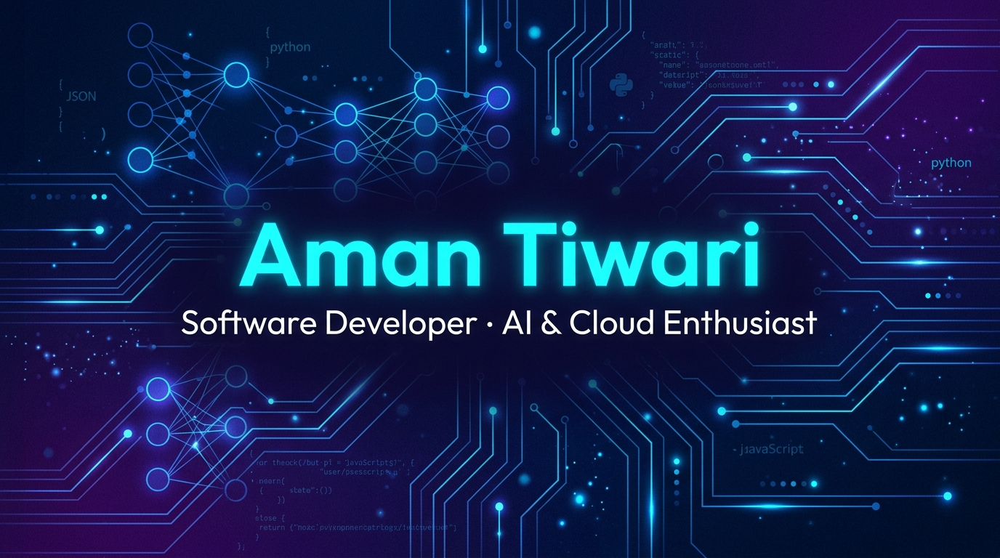

  

# Hi there, I'm Aman Tiwari 👋

### Software Developer · AI & Cloud Enthusiast · Open to Work

---

---

## 👨‍💻 About Me

- 🎓 **B.Tech CSE Graduate** — Kashi Institute of Technology, AKTU Lucknow (CGPA: 7.95)
- 📍 Based in **Varanasi, U.P., India**
- 🚀 Passionate about building **AI-powered full-stack applications**
- ☁️ Strong interest in **Cloud Architecture, LLMs & Serverless Systems**
- 🌱 Currently exploring **Agentic AI & RAG-based systems**
- 💼 **Open to Work** — Looking for Software Developer roles
- 📫 Reach me at **amantripathi912@gmail.com**
* 🔗 **Connect with me on** [LinkedIn](https://www.linkedin.com/in/tiwari-aman1999/)

---

## 🛠️ Tech Stack

**Languages & Frameworks**

**AI & Generative AI**

**Cloud & DevOps**

**Tools**

---

## 🚀 Featured Projects

### 🤖 [CloudChat — Serverless AI Chatbot on AWS](https://github.com/Aman-Farmer19/AI-Chatbot-With-AWS-LLM-Integration)

> Production-ready serverless chatbot powered by Google Gemini 2.5 Flash & OpenAI GPT-4o-mini

- Architected serverless backend using AWS Lambda + API Gateway with provider-agnostic LLM abstraction
- Stateful multi-turn conversations persisted in Amazon S3 with structured JSON session storage
- Granular error handling with exponential back-off retry logic + 16 fully passing unit tests
- Responsive chat UI with dark/light mode achieving sub-3 second response latency

---

### 🎬 [Reelify-2.0 — AI Powered Short Video Generator](https://github.com/Aman-Farmer19)

> AI platform that transforms text prompts into short-form videos automatically

- Built AI-powered video generation pipeline using structured prompt engineering
- Full-stack React + Flask application with authentication and interactive dashboard

---

### 🎬 [NextFlix — AI Movie Recommendation System](https://github.com/Aman-Farmer19)

> Personalized movie recommendations powered by an AI recommendation engine

- AI recommendation engine analyzing user preferences and viewing patterns
- Real-time TMDb API integration with mobile-first responsive design

---

## 📊 GitHub Statistics

---

## 🏆 Certificates

- 🎯 **Be10x** — AI Tools Workshop | Generative & Agentic AI, Prompt Engineering | Jun 2026
- 🐍 **AI For Techies** — Python Using AI Workshop | Jul 2026
- 💼 **Centum Foundation** — Employability Enhancement Programme | Sep 2025
- ## 📜 Certifications

* 🏅 **30 Day Python Using AI Program** — **AI for Techies** *(Issued: July 13, 2026)*
  * ⚡ **AI-Assisted Python Development:** Writing & structuring Python code with AI in seconds
  * 🐞 **AI-Powered Code Debugging:** Fast error detection and automated debugging
  * 📊 **Data Visualization:** Creating interactive Python data visualizations in minutes

---

## 🎯 Interests

`Artificial Intelligence` `LLMs` `Cloud Architecture` `Competitive Programming` `Prompt Engineering` `Cricket` `Cooking`

---

### 💜 Code • Learn • Build • Repeat 💜

